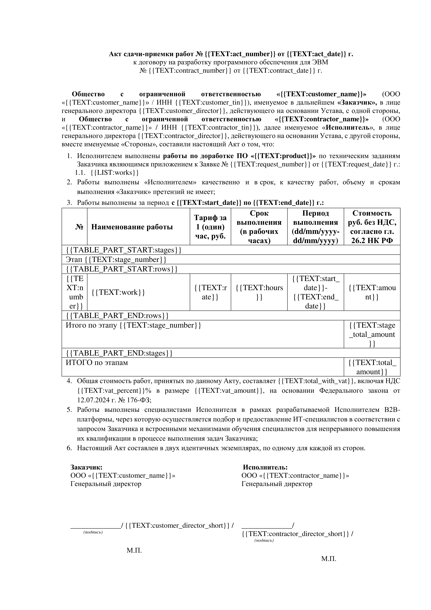
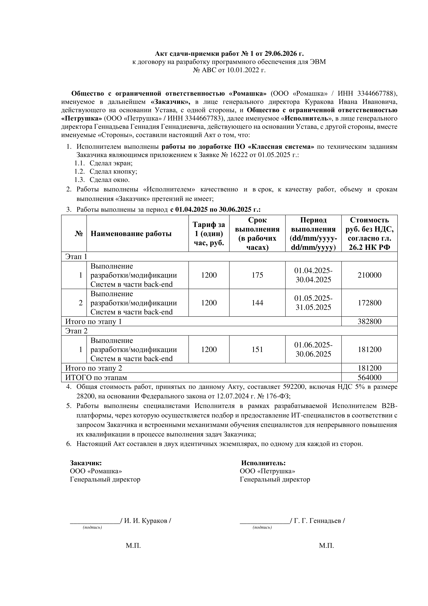

# DocumentService

Сервис для генерации документов на основе шаблонов DOCX.

В качестве примера реализована генерация **акта сдачи-приёмки выполненных работ**.

---

## Технологический стек

### Основные технологии

* Java 17
* Spring Boot 4.1.0
* Maven

### Инфраструктура

* PostgreSQL - реляционная база данных
* MinIO - объектное хранилище
* Docker - контейнеризация

### Используемые библиотеки

* Spring Web MVC - REST API
* Spring Validation - валидация входных данных
* Spring Data JPA - ORM
* Liquibase - управление миграциями БД
* Lombok - генерация шаблонного кода
* MapStruct - маппинг объектов
* Petrovich - склонение ФИО
* IBM ICU4J - генерация денежных сумм прописью
* Apache POI - работа с DOCX-документами

---

## Структура проекта

```text
src/main/java/org/example/documentservice/
    configuration/  # Классы конфигурацций и проперти
    controller/     # REST контроллеры
    dto/            # Data Transfer объекты
    enums/          # Классы перечислений
    exception/      # Классы исключений
    handler/        # Глобальный обработчик исключений
    mapper/         # Классы мапперов
    model/          # Сущности БД
    repository/     # Классы репозиториев БД
    service/        # Бизнес-логика
    strategy/       # Классы стратегий заполнения документа и замены плейсхолдеров
    utils/          # Утилитарные классы
    DocumentServiceApplication.java
src/main/resources/
    db/changelog/   # Миграции БД
    application.yaml
src/test/java/org/example/documentservice/
    controller/     # Тесты контроллеров
    service/        # Тесты бизнес-логики
    utils/          # Тесты утилитарных классов
    DocumentServiceApplicationTests.java
pom.xml
```

---

## Быстрый запуск

### Требования

* Java 17
* Maven
* Docker

### 1. Клонирование репозитория

```bash
git clone https://github.com/kistyan/DocumentService
cd DocumentService
```

### 2. Запуск инфраструктуры

```bash
docker compose up -d
```

### 3. Запуск приложения

Из IDE или командой:

```bash
mvn spring-boot:run
```

После запуска сервис будет доступен по адресу:

```text
http://localhost:8080
```

---

## Шаблоны документов

Документы создаются на основе шаблонов DOCX.

Шаблон представляет собой обычный документ Microsoft Word, содержащий специальные текстовые метки - **плейсхолдеры**.

Плейсхолдеры используются для:

* подстановки значений;
* генерации повторяющихся элементов (например, строк таблиц).

Каждый плейсхолдер состоит из двух частей:

* **тип** - определяет способ обработки;
* **ключ** - связывает плейсхолдер с данными.

На данный момент поддерживаются следующие типы плейсхолдеров:

| Тип                | Описание                                 |
| ------------------ |------------------------------------------|
| `TEXT`             | Замена плейсхолдера текстовым значением. |
| `LIST`             | Замена плейсхолдера списком значений.    |
| `TABLE_PART_START` | Начало повторяющейся части таблицы.      |
| `TABLE_PART_END`   | Окончание повторяющейся части таблицы.   |

При замене плейсхолдеров форматирование документа (шрифт, размер, цвет, стили и другие параметры оформления) сохраняется.

Формат плейсхолдера задаётся свойством:

```
document.placeholder-regex
```

или переменной окружения:

```
PLACEHOLDER_REGEX
```

По умолчанию используется регулярное выражение:

```
\{\{(\w+):(\w+)\}\}
```

Пример плейсхолдера:

```
{{TEXT:contract_number}}
```

В каталоге `examples` представлены:

* шаблон документа - `work_acceptance_act.docx`;
  <br>
  
* пример документа, сгенерированного по этому шаблону - `Акт_сдачи-приёмки_работ_№1.docx`.
  <br>
  

---

## API

### 1. Генерация акта сдачи-приёмки работ

```
POST /api/v1/document-service/work-acceptance-acts
```

### Параметры запроса

| Параметр                              | Обязательный | Тип           | Описание                    |
| ------------------------------------- | ------------ | ------------- | --------------------------- |
| contract.number                       | Да           | string        | Номер договора              |
| contract.date                         | Да           | string        | Дата договора (yyyy-MM-dd)  |
| request.number                        | Да           | string        | Номер заявки                |
| request.date                          | Да           | string        | Дата заявки (yyyy-MM-dd)    |
| customer.name                         | Да           | string        | Наименование заказчика      |
| customer.tin                          | Да           | integer       | ИНН заказчика               |
| customer.director.first_name          | Да           | string        | Имя директора               |
| customer.director.last_name           | Да           | string        | Фамилия директора           |
| customer.director.patronymic          | Нет          | string        | Отчество директора          |
| customer.director.gender              | Да           | string        | MALE, FEMALE или BOTH       |
| contractor.name                       | Да           | string        | Наименование исполнителя    |
| contractor.tin                        | Да           | integer       | ИНН исполнителя             |
| contractor.director.first_name        | Да           | string        | Имя директора               |
| contractor.director.last_name         | Да           | string        | Фамилия директора           |
| contractor.director.patronymic        | Нет          | string        | Отчество директора          |
| contractor.director.gender            | Да           | string        | MALE, FEMALE или BOTH       |
| product                               | Да           | string        | Наименование продукта       |
| works[]                               | Да           | array[string] | Перечень выполненных работ  |
| work_table.stages[].rows[].work       | Да           | string        | Наименование работы         |
| work_table.stages[].rows[].rate       | Да           | number        | Тариф                       |
| work_table.stages[].rows[].hours      | Да           | integer       | Количество часов            |
| work_table.stages[].rows[].start_date | Да           | string        | Дата начала (yyyy-MM-dd)    |
| work_table.stages[].rows[].end_date   | Да           | string        | Дата окончания (yyyy-MM-dd) |
| vat_percent                           | Да           | number        | Ставка НДС                  |

### Пример запроса

```json
{
  "contract": {
    "number": "ABC",
    "date": "2022-01-10"
  },
  "request": {
    "number": "16222",
    "date": "2025-05-01"
  },
  "customer": {
    "name": "Ромашка",
    "tin": 3344667788,
    "director": {
      "first_name": "Иван",
      "last_name": "Кураков",
      "patronymic": "Иванович",
      "gender": "MALE"
    }
  },
  "contractor": {
    "name": "Петрушка",
    "tin": 3344667783,
    "director": {
      "first_name": "Геннадий",
      "last_name": "Геннадьев",
      "patronymic": "Геннадиевич",
      "gender": "MALE"
    }
  },
  "product": "Классная система",
  "works": [
    "Сделал экран",
    "Сделал кнопку",
    "Сделал окно"
  ],
  "work_table": {
    "stages": [
      {
        "rows": [
          {
            "work": "Выполнение разработки/модификации Систем в части back-end",
            "rate": 1200,
            "hours": 175,
            "start_date": "2025-04-01",
            "end_date": "2025-04-30"
          },
          {
            "work": "Выполнение разработки/модификации Систем в части back-end",
            "rate": 1200,
            "hours": 144,
            "start_date": "2025-05-01",
            "end_date": "2025-05-31"
          }
        ]
      },
      {
        "rows": [
          {
            "work": "Выполнение разработки/модификации Систем в части back-end",
            "rate": 1200,
            "hours": 151,
            "start_date": "2025-06-01",
            "end_date": "2025-06-30"
          }
        ]
      }
    ]
  },
  "vat_percent": 5
}
```

### Успешный ответ

```http
200 OK
```

| Поле   | Тип    | Описание                |
| ------ | ------ | ----------------------- |
| id     | UUID   | Идентификатор документа |
| number | string | Номер акта              |

Пример:

```json
{
  "id": "775ce204-eacf-4be9-9d59-8a50f15a407e",
  "number": "1"
}
```

### Возможные ошибки

| Код | Описание                           |
| --- |------------------------------------|
| 400 | Неправильный формат входных данных |
| 500 | Внутренняя ошибка сервера          |

---

### 2. Загрузка документа

```
GET /api/v1/document-service/work-acceptance-acts/download/{id}
```

### Параметры

| Параметр | Тип  | Описание           |
| -------- | ---- | ------------------ |
| id       | UUID | Идентификатор акта |

### Успешный ответ

```http
200 OK
```

DOCX-файл.

### Возможные ошибки

| Код | Описание                   |
| --- | -------------------------- |
| 404 | Документ не найден         |
| 500 | Внутренняя ошибка сервера  |

---

## Модель данных

### templates

| Поле | Тип     | Ключ | Описание                       |
| ---- | ------- |------|--------------------------------|
| name | varchar | PK   | Имя шаблона                    |
| path | varchar |      | Путь к файлу в бакете шаблонов |

### documents

| Поле          | Тип       | Ключ                | Описание                         |
| ------------- | --------- |---------------------|----------------------------------|
| id            | uuid      | PK                  | Идентификатор документа          |
| template_name | varchar   | FK → templates.name | Имя шаблона                      |
| path          | varchar   |                     | Путь к файлу в бакете документов |
| creation_date | timestamp |                     | Дата создания                    |

### work_acceptance_acts

| Поле            | Тип           | Ключ              | Описание                 |
| --------------- | ------------- |-------------------|--------------------------|
| id              | uuid          | PK                | Идентификатор акта       |
| document_id     | uuid          | FK → documents.id | Идентификатор документа  |
| number          | varchar       |                   | Номер акта               |
| date            | date          |                   | Дата акта                |
| contract_number | varchar       |                   | Номер договора           |
| request_number  | varchar       |                   | Номер заявки             |
| customer_name   | varchar       |                   | Наименование заказчика   |
| customer_tin    | bigint        |                   | ИНН заказчика            |
| contractor_name | varchar       |                   | Наименование исполнителя |
| contractor_tin  | bigint        |                   | ИНН исполнителя          |
| product         | varchar       |                   | Наименование продукта    |
| total_amount    | decimal(19,2) |                   | Общая стоимость работ    |

---

## Объектное хранилище

В объектном хранилище (MinIO) расположены два бакета:

* **templates** - хранение шаблонов;
* **documents** - хранение сгенерированных документов.

Во время генерации сервис:

1. Загружает актуальную версию шаблона из бакета шаблонов.
2. Генерирует документ.
3. Сохраняет результат в бакет документов.

Названия бакетов могут быть настроены через свойства приложения или переменные окружения.

| Свойство                 | Переменная окружения | Значение по умолчанию |
| ------------------------ | -------------------- | --------------------- |
| document.template-bucket | TEMPLATE_BUCKET      | templates             |
| document.document-bucket | DOCUMENT_BUCKET      | documents             |
